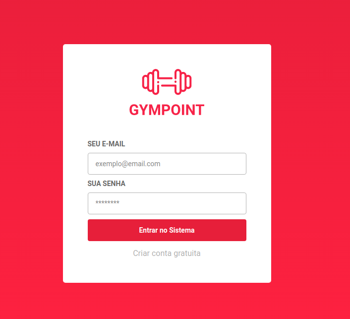
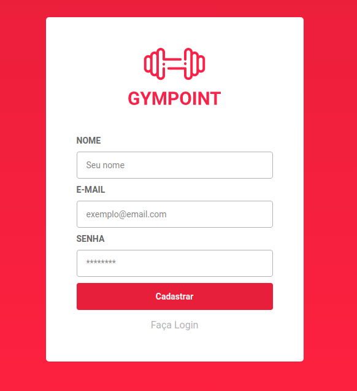
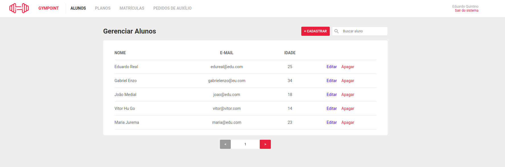
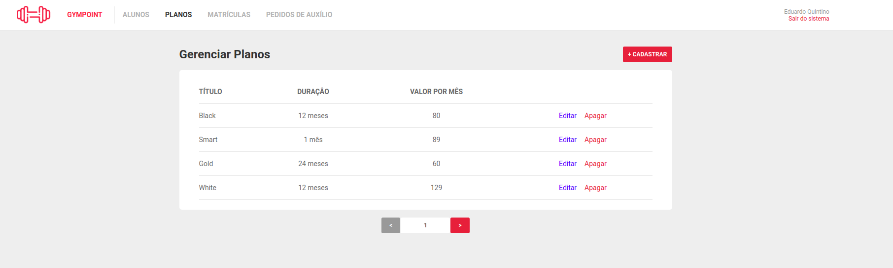
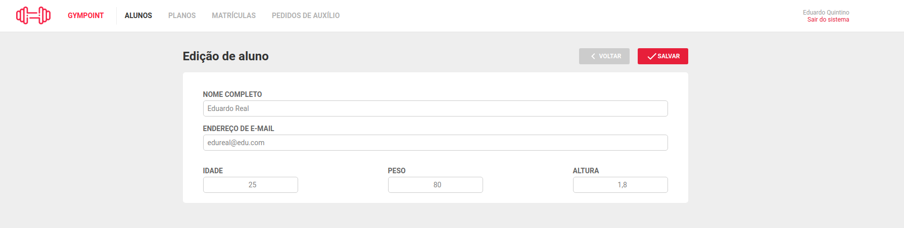
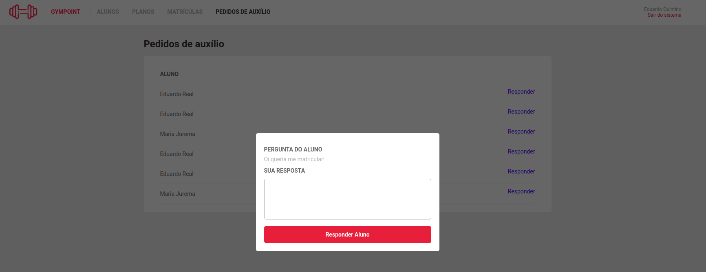
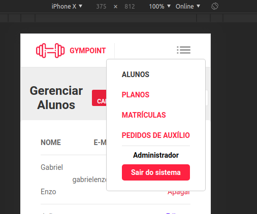

# Gympoint

## Desafio Final Rocketseat GoStack ReactJS

## Características do software

### Funcionalidades

* Login.
* Logout.
* Registro de administrador.
* CRUD de Alunos, Planos e Matrículas.
* Listagem e Resposta de Perguntas à Alunos.
* Paginação.
* Header com navegação.
* Feedback com toasts.
* Botão Sanduíche para telas pequenas.

### Tecnologias principais

* Redux.
* Redux-saga.
* Somente Functional Components.
* Utilização de React Hooks.
* Componente de Modal.
* Axios para requisições.
* Integrado ao backend Gympoint em Node.js.
* Prettier, EditorConfig e Prettier para estilizações de código.
* Utilização de bibliotecas de datas, date-fns, react-datepicker.
* Redux persist.
* Yup para validação de schemas.
* Unform para criação de formulários.


## Como executar com Docker

Clone e execute em um terminal o [backend da aplicação](https://github.com/eduqg/GympointBack).

Em um outro terminal, faça a build do projeto.

```console
docker build -t frontgympoint .
```

Execute o container criado.

```console
docker run -it -p 8080:80 frontgympoint
```

Abra o navegador em [localhost:8080](http://localhost:8080).

## Testes

Utilize cypress para os testes da aplicação.

```console
yarn cypress
```

Isto irá abrir uma janela, clique em seguida em Run all specs e veja a mágica acontecer.


## Imagens

Login e logout

 

Listagem




Editar




Respostas a alunos



Sanduíche



