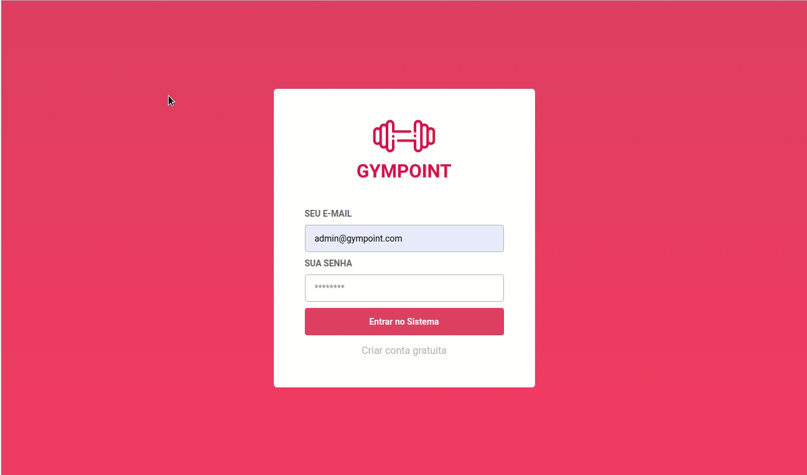
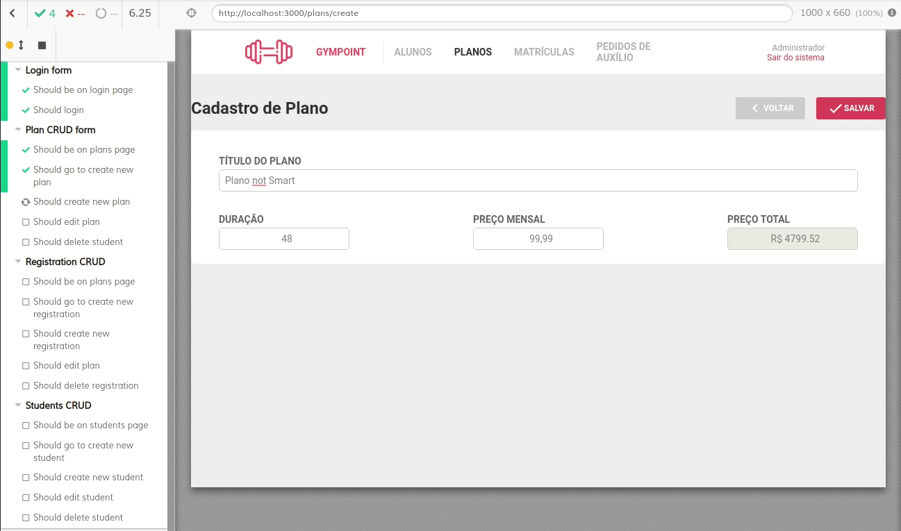

# Gympoint

## Desafio Final Rocketseat GoStack ReactJS



## Características do software

### Funcionalidades

* Login.
* Logout.
* Registro de administrador.
* CRUD de Alunos, Planos e Matrículas.
* Listagem e Resposta de Perguntas à Alunos.
* Paginação.
* Header com navegação.
* Feedback com toasts.
* Botão Sanduíche para telas pequenas.

### Tecnologias principais

* Redux.
* Redux-saga.
* Somente Functional Components.
* Utilização de React Hooks.
* Componente de Modal.
* Axios para requisições.
* Integrado ao backend Gympoint em Node.js.
* Prettier, EditorConfig e Prettier para estilizações de código.
* Utilização de bibliotecas de datas, date-fns, react-datepicker.
* Redux persist.
* Yup para validação de schemas.
* Unform para criação de formulários.

## Execução

Clone e execute em um terminal o [backend da aplicação](https://github.com/eduqg/GympointBack).

<!-- ### Com Docker

Em um outro terminal, faça a build do projeto.

```console
docker build -t frontgympoint .
```

Execute o container criado.

```console
docker run -it -p 8080:80 frontgympoint
```

Abra o navegador em [localhost:8080](http://localhost:8080). -->

Crie um arquivo .env.

```console
cp .env-example .env
```

Adicione o seu ip no arquivo criado.

### Local

Instale as dependências do projeto.

```console
yarn
```

Execute a aplicação.

```console
yarn start
```

<!-- Para executar os testes, configure o arquivo cypress.json

```console
"baseURL": "http://localhost:3000/"
``` -->

Em outro terminal, execute o cypress.

```console
yarn cypress
```

Isto irá abrir uma janela, clique em seguida em Run all specs e veja a mágica acontecer.



## Docker

Instale a extensão do VSCode [Remote - Containers](https://marketplace.visualstudio.com/items?itemName=ms-vscode-remote.remote-containers). 

No VSCode use o atalho CMD/CTRL + Shift + P e selecione a opção Remote-Container: Reopen in Container. 

Isto irá abir uma nova janela do Visual Studio Code e vai demorar alguns minutos para configurar o container.

Após isso, abra o terminal no Visual Studio Code com CMD/CTRL + Shift + `

Execute a aplicação.

```console
yarn start
```

Abra o navegador em [localhost:3000](http://localhost:3000)

Execute os testes com cypress no Electron, um navegador headless.

```console
yarn cypresscontainer
```

Caso necessário instale o cypress no container.

```console
./node_modules/.bin/cypress install
```

[Tutorial de apoio](https://medium.com/the-telegraph-engineering/remote-development-with-vs-code-a8d8fe8aa9e)


## Imagens

Login e logout

 

Listagem


Editar


Respostas a alunos


Sanduíche


